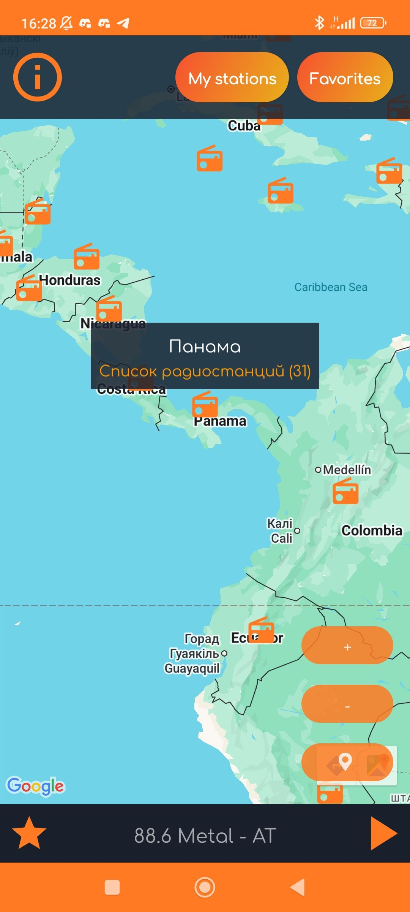
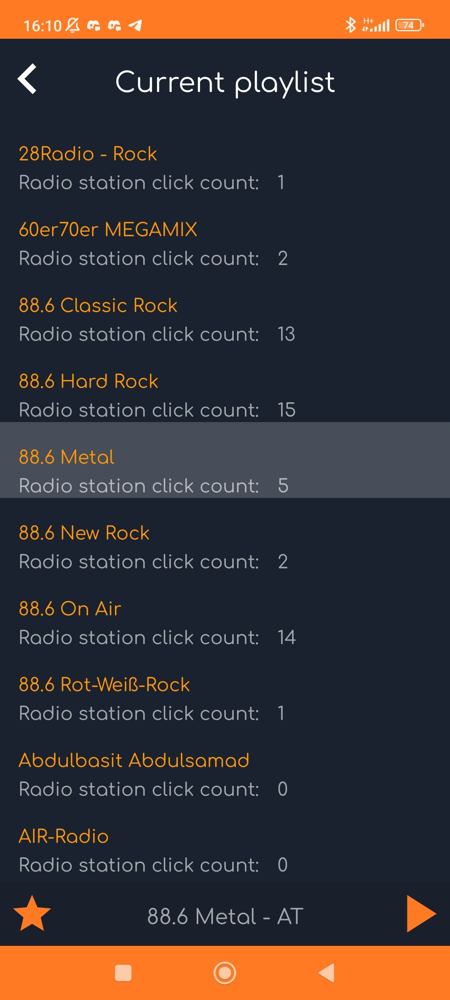
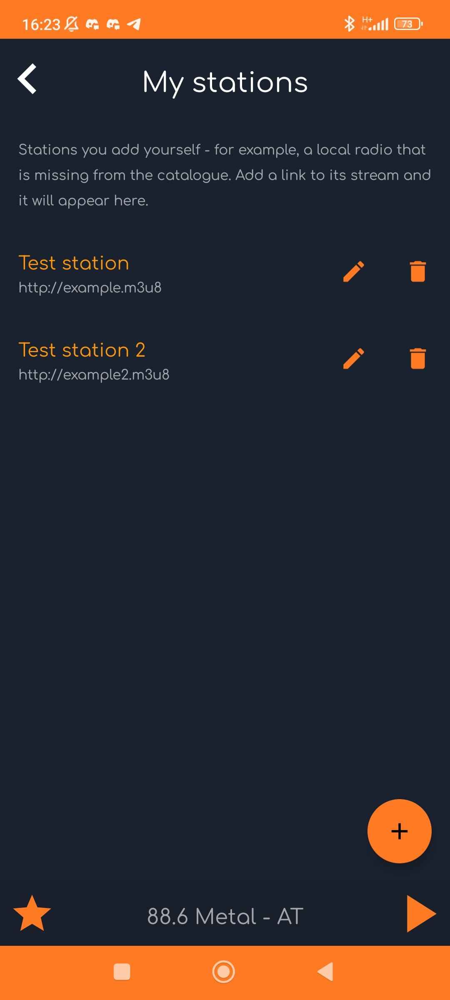
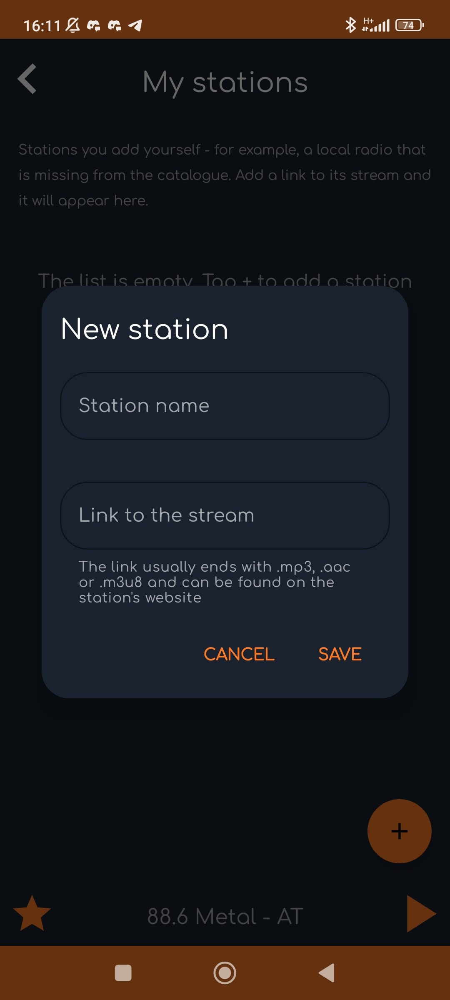

# RadioJourney

Android-приложение для прослушивания интернет-радио со всего мира: выбираете страну на карте —
слушаете её станции.

Автор — Алина Петрова (Alina Piatrova). Проект начинался как дипломная работа, сейчас это личный
проект, который я
продолжаю развивать.

*[English version below](#english)*

<p>
  
  
  
  
</p>

---

## Что умеет приложение

- **Карта мира с маркерами стран.** На маркере видно, сколько в стране радиостанций; по клику
  открывается их список.
- **Плеер внизу экрана.** Виден на всех экранах, станции листаются свайпом, играет в фоне и
  управляется из уведомления.
- **Избранное.** Звезда на станции — и она попадает в отдельный список, который можно включить как
  плейлист.
- **Свои станции.** Станцию, которой нет в каталоге, можно добавить самому по ссылке на поток, а
  потом изменить или удалить.
- **Текущий плейлист.** Список станций, которые сейчас в плеере, с подсветкой играющей станции.
- **Работа при плохой связи.** Списки станций сохраняются в телефоне: если сервер каталога
  недоступен, приложение покажет сохранённый список и объяснит, что произошло.

Данные о станциях приложение берёт из открытого
каталога [radio-browser.info](https://www.radio-browser.info/). Каталог бесплатный, автор разрешает
использовать его в бесплатных и платных программах.

## Как устроен проект

Приложение написано на Kotlin, по MVVM и чистой архитектуре (три слоя: `data`, `domain`,
`presentation`).

| Что                    | Чем сделано                                                                      |
|------------------------|----------------------------------------------------------------------------------|
| Внедрение зависимостей | Hilt (+ KSP)                                                                     |
| Экраны                 | View (не Compose), View Binding, Navigation Component с Safe Args                |
| Асинхронность          | Coroutines, Flow (StateFlow / SharedFlow / Channel)                              |
| Сеть                   | Retrofit2 + OkHttp + Gson                                                        |
| База данных            | Room (страны для карты, избранное, свои станции, сохранённые списки)             |
| Настройки              | DataStore Preferences                                                            |
| Фоновая загрузка       | WorkManager (список стран)                                                       |
| Радио                  | media3 (ExoPlayer + MediaLibraryService), фоновое воспроизведение с уведомлением |
| Карта                  | Google Maps SDK for Android                                                      |

Комментарии в коде — на русском: проект заодно служит мне конспектом, поэтому в классах написано не
только *что* они делают, но и *почему* сделано именно так.

Указатель «какая задача где решена» — в [REUSE.md](REUSE.md).

## Сборка

Нужен свой ключ Google Maps: получите его в Google Cloud Console (Maps SDK for Android) и положите в
`local.properties`:

```
MAPS_API_KEY=ваш_ключ
```

Файл `local.properties` в репозиторий не попадает. Дальше — обычная сборка в Android Studio.

## Условия использования

**© 2022–2026 Алина Петрова (Alina Piatrova). Все права защищены.**

Исходный код открыт для чтения и изучения. Это **не** разрешение использовать его в своих проектах.

Без моего письменного разрешения нельзя:

- копировать код, целиком или частями, в другие проекты;
- публиковать приложение или его переделку в магазинах приложений;
- использовать оформление приложения — экраны, цвета, иконки, тексты и название RadioJourney.

Что можно: читать код, учиться по нему, обсуждать его со мной, задавать вопросы в Issues.

Если хотите что-то из этого использовать — напишите мне, я почти наверняка не против, мне важно
знать, где и как.

Сторонние материалы, которые в приложении используются на условиях их авторов: каталог
станций [radio-browser.info](https://www.radio-browser.info/), изображения
с [pixabay.com](https://pixabay.com/), координаты стран
из [Google public data](https://developers.google.com/public-data/), а также библиотеки с открытыми
лицензиями (см. `app/build.gradle`).

---

<a name="english"></a>

# RadioJourney (English)

An Android app for listening to internet radio from all over the world: pick a country on the map
and listen to its stations.

Made by Alina Piatrova. It started as my graduate work and is now a personal project that I keep
improving.

<p>
  
  
  
  
</p>

## Features

- **World map with country markers.** A marker shows how many stations the country has; tapping it
  opens the list.
- **Player at the bottom of the screen.** Visible on every screen, stations are switched by swiping,
  plays in the background and is controlled from the notification.
- **Favourites.** Tap the star and the station goes to a separate list that can be played as a
  playlist.
- **Your own stations.** A station that is missing from the catalogue can be added by its stream
  link, then edited or deleted.
- **Current playlist.** The stations currently loaded in the player, with the playing one
  highlighted.
- **Works on a poor connection.** Station lists are kept on the phone: if the catalogue server is
  unavailable, the app shows the saved list and explains what happened.

Station data comes from the open [radio-browser.info](https://www.radio-browser.info/) catalogue,
which is free to use in both free and commercial software.

## Tech stack

Kotlin, MVVM and clean architecture (`data`, `domain`, `presentation`).

Hilt (KSP), Views with View Binding, Navigation Component with Safe Args, Coroutines and Flow,
Retrofit2 + OkHttp + Gson, Room, DataStore Preferences, WorkManager, media3 (ExoPlayer +
MediaLibraryService), Google Maps SDK for Android.

Code comments are in Russian: the project doubles as my own study notes, so classes explain not only
*what* they do but *why* it is done this way.

## Building

You need your own Google Maps key (Maps SDK for Android) in `local.properties`:

```
MAPS_API_KEY=your_key
```

## Terms of use

**© 2022–2026 Alina Piatrova. All rights reserved.**

The source code is open to read and to learn from. That is **not** a permission to use it in your
own projects.

Without my written permission you may not:

- copy the code, in whole or in part, into other projects;
- publish the app or a modified version of it in app stores;
- use the app's design — screens, colours, icons, texts or the RadioJourney name.

You may read the code, learn from it, discuss it with me and ask questions in Issues.

If you would like to use any of it, please write to me — I am very likely fine with it, I just want
to know where and how.

Third-party material used under its own terms:
the [radio-browser.info](https://www.radio-browser.info/) catalogue, images
from [pixabay.com](https://pixabay.com/), country coordinates
from [Google public data](https://developers.google.com/public-data/), and open-source libraries (
see `app/build.gradle`).